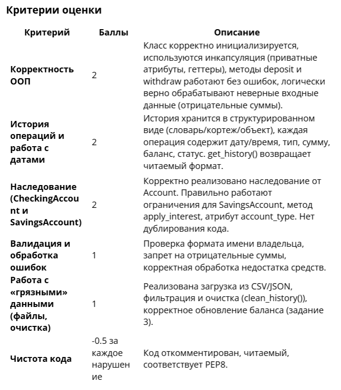

Домашнее задание 1
Дисциплина: Язык Python для разработчиков.
Темы: 1-4.
Форма проверки: проверка преподавателем.
Имя преподавателя: Геннадий Осипов.
Время выполнения: 6 академических часов.
Цель задания: отработать навыки разработки программ на Python.
Инструменты для выполнения задания: Jupyter Notebook или Google Colab.

Правила приёма работы:
Прикрепите в личном кабинете ссылку на выполненное задание в Google Colab или GitHub, если вы использовали Jupyter Notebook.
Важно: убедитесь, что по ссылке есть доступ в Google Colab (иногда в Google Colab нет доступа для другого логина).
Задание считается выполненным:
● если прикреплена ссылка на код с выполненным заданием,
● доступ к файлу открыт,
● код выполняется и даёт правильный ответ к задаче.

Задание считается невыполненным:
● если ссылка на код с выполненным заданием не прикреплена,
● отсутствует доступ по ссылке,
● код не выполняется.

Дедлайн: 14 дней после даты проведения вебинара 5.

Задание 1.
Реализуйте базовый класс Account, который моделирует поведение банковского счёта. Этот класс должен не только выполнять базовые операции, но и вести детальный учёт всех действий, а также предоставлять аналитику по истории операций.

Этап 1. Реализация базового класса Checkingсса Account
Класс должен быть инициализирован с параметрами:
● account_holder (str) — имя владельца счёта;
● balance (float, по умолчанию 0) — начальный баланс счёта, не может быть отрицательным.

Атрибуты:
● _account_counter — приватный атрибут для хранения количества созданных счетов. Отсчет начинается с 1000;
● holder — хранит имя владельца;Checking
● account_number — хранит номер счёта;
● _balance — приватный атрибут для хранения текущего баланса;
● operations_history — список или другая структура для хранения истории операций.

Важно: каждая операция должна храниться не просто как число, а как структурированная информация, например, словарь, кортеж или класс. Минимальный набор данных для операции: тип операции (‘deposit’ или ‘withdraw’), сумма, дата и время операции, текущий баланс после операции, статус (‘success’ или ‘fail’).

Этап 2. Реализация методов

init(self, account_holder, balance=0) — конструктор. Обратите внимание, что в конструкторе должен автоматически формироваться номер счёта в формате ‘ACC-XXXX’, где XXXX — порядковый номер счёта;
deposit(self, amount) — метод для пополнения счёта:
● принимает сумму (должна быть положительной), попытка положить отрицательную сумму, должна вызывать исключение;
● в случае успеха обновляет баланс и добавляет запись в историю операций.
withdraw(self, amount) — метод для снятия средств:
● принимает сумму (должна быть положительной);
● проверяет, достаточно ли средств на счёте, если нет — операция не проходит, но ее попытка с статусом ‘fail’ все равно фиксируется в истории;
● в случае успеха обновляет баланс и добавляет запись в историю.
get_balance(self) — метод, который возвращает текущий баланс.
get_history(self) — метод, который возвращает историю операций.
Важно: продумайте, в каком формате его вернуть. Для работы с датой и временем используйте модуль datetime. Получить текущее время можно с помощью datetime.now().

Задание 2.
Этап 3. Реализация наследования
Реализуйте два класса CheckingAccount (расчётный счёт) и SavingsAccount (сберегательный счёт), которые отражают абстракцию базового поведения банковских аккаунтов:
● наследуются от базового класса Account;
● хранят атрибут класса account_type.

Класс SavingsAccount (сберегательный счёт) дополнительно должен реализовывать метод расчёта процентов на остаток apply_interest(self, rate) (например, 7% на остаток).
Класс SavingsAccount (сберегательный счёт) позволяет снимать деньги только до определенного порога баланса: нельзя снять больше 50% от баланса. Переопределите метод снятия со счёта.
Реализуйте валидацию на отрицательные суммы и корректность имени владельца:
● имя владельца счёта должно быть в формате «Имя Фамилия» с заглавных букв, кириллицей или латиницей, иначе — должно вызываться исключение;
● попытка положить отрицательную сумму должна вызывать исключение.
Реализуйте метод для анализа истории транзакций по размеру и дате:
● метод должен выводить последние n крупных операций.
Задание 3. Задание для претендущих на оценку 8 и более баллов (выполняется по желанию).
Перед началом работы загрузите из личного кабинете файлы, на которых можно проверить код с «грязными» данными: transactions_dirty.csv и transactions_dirty.json.
Реализуйте для классов аккаунтов CheckingAccount (расчётный счёт) и SavingsAccount (сберегательный счёт) два метода:
● Метод загрузки истории в аккаунт из файла с транзакциями (файл транзакций общий для всех аккаунтов, необходимо учесть фильтрацию загружаемых значений).
● Метод clean_history(), который ищет ошибки в данных перед записью транзакций в историю (опечатки, отрицательные суммы, неверные даты). Обратите внимание, что для SavingsAccount (сберегательный счёт) доступно три типа операции (deposit, withdraw и interest), в то время как для CheckingAccount (расчётный счёт) доступны только два типа операции (deposit, withdraw). Все данные с ошибками считаем невалидными и не записываем в историю операций.
● После загрузки истории операций в аккаунт, баланс счёта должен обновиться.

Максимальное количество баллов за задание — 10.
Максимальное количество баллов, которое можно получить, отлично выполнив все требования, заявленные в критериях оценки, — 8. Преподаватель по своему усмотрению может добавить 1–2 балла к этой оценке за творческий подход к выполнению задания, решение, выходящее за рамки программы и требуемого функционала.